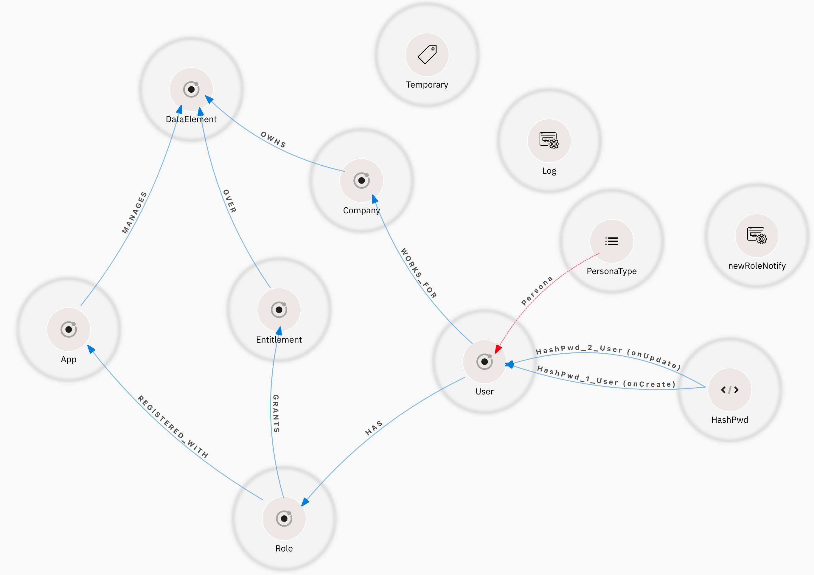

# 3Edges graph models
A set of models for 3Edges

These graph data models are meant to be loaded and visualized in the 3Edges Dynamic Authorization platform: https://3edges.io .
Each model is a starting-point template provided to solve a specific authorization use-case. Those templates are meant to be used as-is, or modified as appropriate.

Each file is a template that caters to a different authorization use-cass. All templates can be modified as needed to fit a wide variety of use-cases.

## Table of contents
1. [How to use?](#howto)
2. [Authorization Graphs](#graphs)
   1. [Simple Device Management](#device)
   2. [Banking](#banking)
   3. [Role-Based Access control (RBAC)](#rbac)
   4. [Files](#files)
   5. [Consent-based authorization](#consent)
   6. [IoT Access](#iot)
   7. [Verifiable Credentials Based Authorization (VCBAC)](#vc)

# How to use 
To use these models, simply:
1. Register with 3Edges: https://3edges.io/new-user 
2. Create a new Deployment (within an organization or standalone) - refer to the [Documentation](https://docs.3edges.com/space/3edgesDoc/2211512321/Introduction) for details about *deployments*, *organizations* or *standalone* configurations.
3. Open the new (or existing) Deployment
4. Select the ellipsis, then "Import"

**Note 1**: any existing model will be overwritten.
**Note 2**: to access the authorization policies defined in any of these models, toggle to the "Ontology" view in the 3Edges UI canvas.

# Authorization Graph Models 
## Simple Device : `SimpleDevice-authz.json` 
A simple model to store and use user / device ownership to restrict access to Devices. The devices in this model can represent any physical smart object: Mobile phones, IoT , machines, etc.

### Model:

### Model Types:
- **User**: the subjects in this model: users can own Devices or not. They will only be able to access the devices if they own them.
- **Device**: the Resources being protected here.

### When to use
Use for any simple Five-Grained (FGA) access control scheme. The "Device" type can be renamed to represent any type of resource to protect, at any granularity level. This results in a system close to Zanzibar-like ReBAC systems.

## Banking : `Banking-authz.json`  
A model geared towards the Banking sector. It protects bank accounts based on the branches that host them and the user entitlements over these accounts granted to the users. This sample also provides some sample low-code configurations and scripting, notably to send automated emails on User creation.

### Model
 

### Model Types:
- **User**: the subjects in this model, user can own bank Accounts, or be granted some Entitlements over some accounts.
- **Account**: logical representation of a (Bank) account. It's the main resource to protect here.
- **Permission**: a representation of an entitlement over any given Account. 
- **Bank**: the Banking organization the user works for, if the User node represents an employee. Account owners may not necessarily be Bank employees, but only bank employees will have a `WORKS_FOR` relationship.
- **Branch**: represent Bank Branch. Branches hold the actual Accounts. Representing branches in the model allows us to also restrict access based on branches.

### Enums:
`ENUM` objects are enumerations of values. They describe the set of possible values a given property may have. In other words, an Enum property may not have a value outside the list of provided values. Enums become Properties on the Node Types they are related to. The name of those type properties is given in the relationship from the Enum to the type.

- **BranchType** : the branch type, whether it's the Main or other branch.
- **AccountType**: the type of account, Credit, Savings, etc
- **CRUDPermissions**: a list of operations that can be granted over an Account. The provided values are for Create, Read, Update, Delete (CRUD).

### Scripts:
Scripts are litle code snippets written in JavaScript that are triggered automatically at runtime when a configured event happens on the Object Type they are linked to. Here, the `SendEmail` script will automatically email the new user every time a new user node is created (`onCreate` event).

### Authorization policies
Switching to the "Ontology" view reveals the ReBAC policies defined on the model:
- Account and Permission nodes are all Resources to protect.
- Users are the subjects in all authorization requests.
- Paths must exist in the underlying data Graph between Users and Accounts in order to grant access to the accounts. 2 possible paths:
  - Direct account ownership
  - Going through a permission. I.e., specific permissions have been granted to the user over the account.

## Role-Based Access Control (RBAC) : `RBAC-Data-authz.json` 
A Relationship-Based Access Control (ReBAC) model for RBAC. This model ensures that users have a Role that grants them some Entitlement over a Resource (here a `DataElement` Object type).
This model can easily be modified to cater to any authorization scheme involving Roles and/or Entitlements.

This model provides some extra functionality through the use of 3Edges Labels and Custom Mutations (see below)

### Model:

### Use-case:
The use-case depicted here is as follows:
- The Organization implementing this model owns several subsidiary companies.
- Each of these subsidiaries owns Data Elements: some data that needs protecting. Note that these `DataElement` nodes can represent any resource, even at very fine granularity if needed.
- In order for users to access these Resources, they either need to:
  - work for the subsidiary that owns the data
  - be members of a Role with Entitlements over the Resources, or
  - be registered with an App that manages the given resources

### Model Types:
- **User**: the subjects in this model, users can access `DataElement` resource nodes, and/or work for a given Company subsidiary(ies).
- **Company**: represents subsidiary company Nodes.
- **DataElement**: the resource being protected here, represents any data to protect.
- **Role**: encapsulates an actual Role that Users may be members of. Role nodes could be loaded into the data Graph from LDAP for example (using the [LDAP Graph Loader](https://github.com/3Edges/LdapGraphLoader) or other tool).
- **Entitlement**: represents the type of access granted to the user on a given resource.
- **App**: an app, Web, mobile or other, that can be used to manage the Resources. It is assumed here that only a few users will have access to these Apps.

### Enums
- **PersonaType**: The User Type. That type can only be one of a few allowed/possible values, as provided by this ENUM object type.

### Scripts:
- **hashPwd** : hashes the user's passwords on User create and update (`onCreate` and `onUpdate` events).

### Labels:
Label objects are just Graph labels that can be added or removed dynamically from the actual Graph data at runtime, through special mutations in the deployed API. 
- **Temporary** : Can be used to add a `Temporary` Label to any node. This is specifically useful to mark Temporary users/workers in the database. The label can be removed if the person is hired, for example, or leaves the company.

### Custom Mutations:
Custom Mutations (CM) are custom functions that are added as Mutations to the generated GraphQL API. They implement custom Business Logic that can be triggered through a simple API call.

- **Log**: An example/dummy CM that just logs some data about the currently logged/requesting user.
- **newRoleNotify**: a function that sends an email when called, notifying the recipient of a new Role creation.

## Files : `Documents-authz.json` 
A basic model to protect a file system. The files (typed "Documents" in this model) can be of any type. Files are stored in a hierarchy of Folders, Users may own files directly, or the Folders that stores them.

### Model:

### Model types:
- **User**: the subjects in this model, users can own bank Folders or Documents.
- **Folder**: file system folders; they may store files or other sub-folders.
- **Document**: represents the files to protect.

**Note:** The model distinguishes between 2 types of access privileges: Full Ownership (`OWNS` relationships), which assumes ful access, and Read-only access (`CAN_READ` relationships). 

## Scripts:
This model provides the following automation scripts:
- **hashPwd** : hashes the user's passwords on User create and update (`onCreate` and `onUpdate` events).
- **addCreateDt** : populates the CreateDt field of all new Documents with the date/time of the Document creation (`onCreate` event).
- **logUser** : add an audit log statement everytime a Document node is read (`onRead` event).
- **createOWNS** : automatically adds an `OWNS` relationship between a newly created Document and the User that created it. (`postCreate` event: triggers right after the Document node is actually created in the DB).

### Authorization policies

- Both Folder and Document are resources.
- A path must exist between the User trying to access and the resource they're accessing for the access to be granted.
- If the path follows a `CAN_READ` relationship, then only Read access is granted.

## Consent-Based authorization : `Documents-Consent-authz.json` 
This model is similar to the [Files](#files) model above, with the difference that Folders are replaced by Consent nodes. This model thus records consents provided for accessing Documents. A Document owner may grant consent to access the file to other user.
The Consent type being a first class citizen in this model, it can be queried, managed and used like any other type. 

**Note**: there is no hierarchy of consents here, new consents should be recorded for any different type of access.

### Model:

### Model Types:
This model uses the same types as the [Files](#files) model above, with 1 exception:

- **Consent**: replaces the "Folder" type. Consent nodes represent the actual consent recorded when a used actually consented to grant access to a resource they own. The "Document" type can here be replaced by any other type of resource.

### Scripts:
Thus model uses the same scripts as defined in  [Files](#files) model above, with 1 exception:

- **CreateGRANTS** : script that automatically created the `GRANTS` relationship between the newly created `Consent` Node and the user that created it. The model assumes that the user who created the consent node is indeed the Granter. The Script can easily be removed if this assumption is wrong in your environment.

### Authorization policies
The policies are the same as the [Files](#files) ones, but with `Consent` replacing `Folder`.

## IoT Access Control : `IoT-authz.json` 
The purpose of this model is also to secure Devices, Internet Of Things (IoT) devices specifically, by adding a bit more complexity to the [Simple Device](#device) model seen above.

### Model:

### Use-case:
The Organization implementing this model sells a manages a huge fleet of IoT devices; access to which is granted based on the License purchased by clients (the Users). 
- Licenses grant actions (Entitlements) in the Apps that are use to access/manage the actual devices.
- In some cases, the devices are not "smart" enough (too simple) to have any internet connectivity, in those cases, the managing App must access an Edge Gateway instead to access the device telemetry or change its state in any way.
- Some users may outright own certain devices, in that case their ownership is sufficient to grant them full access ton the device.

### Enums:
- **LicenseTypes**: the possible values for the types of license that Users can purchase.

### Scripts:
- **hashPwd** : hashes the user's passwords on User create and update (`onCreate` and `onUpdate` events).

## Verifiable Credentials Based Authorization (VCBAC): `VerifiableCredentials-authz.json` 
3Edges understands [W3C compliant Verifiable Credentials](https://www.w3.org/TR/vc-data-model/) (VC), and can leverage VCs for authorization. A VC is, in effect, an attribute, or set of attributes pertaining to their Holder; they can therefore be used in Authorization, just l;ike any other attribute.
VCs object types in 3Edges are labelled through the Ontology view, in the same way that Subjects or Resources are labelled.

When 3Edges detects any VCs in its models, it also enables the Issuance of new VCs from the Data Dashboard, through integrations with external providers (currently [Credivera](https://www.credivera.ca/)).

### Model:

### Use-Case:
This model is for an organization that wants to issue *Proof of Employment* VCs to their employees. 
- Employees can then hold these Employment Proofs within their mobile/web wallets and present them as need to any verifier.
- In particular, the organization wants its employees to present their VCs during login, as an additional factor.
- Furthermore, once logged-in, only employees should be able to access certain confidential documents. Holding the appropriate VC is the only necessary check in that case.

**Note**: the model can easily be modified to enforce additional conditions, such as Role membership or more. 

### Model-Types
This model expands any VC into its main components, mainly:
- **The Issuer**: A node type that represents the organization issuing the VC
- **The Holder**: represents the holder of the VC, typically a user or human (but not necessarily.
- **Claim**: Node type that represents the claims within the VC. These are the affirmations carried by the VC.
- **User**: the entity trying to access the protected resource (here `Document`). The Users here are the Holders.
- **Document**: represents a resource being protected. This can be modified to represent any resource, at any level of granularity.
